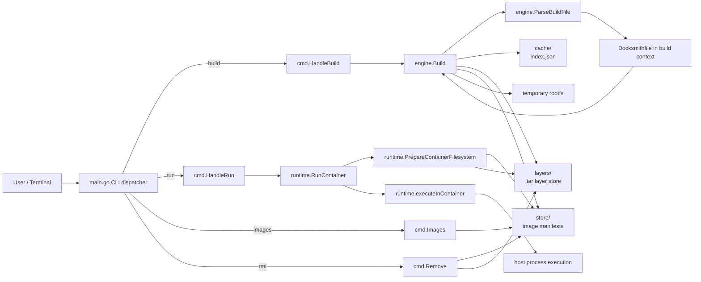

# Docksmith Architecture

## Overview

Docksmith is a small container-style CLI written in Go. It provides four main commands:

- `build` to read a `Docksmithfile`, execute instructions, and persist image metadata
- `run` to execute an image's configured command with environment overrides
- `images` to list stored image manifests
- `rmi` to remove an image and its stored layers

The codebase is organized around a simple pipeline:

1. The CLI parses the command line and dispatches to the relevant handler.
2. The build engine parses the build file and produces filesystem layers and image manifests.
3. The runtime reconstructs a temporary root filesystem and executes the configured command.
4. The cache, layer store, and image store persist build state under `~/.docksmith`.

## Architecture Diagram

## Component Responsibilities

### `main.go`

`main.go` is the entrypoint. It routes the user command to the matching handler in `cmd/` and prints command-specific usage on error.

### `cmd/`

The `cmd` package is the CLI boundary.

- `cmd/build.go` validates `docksmith build -t <name:tag> <context>` and calls the engine.
- `cmd/run.go` parses repeated `-e KEY=value` flags and passes them to runtime execution.
- `cmd/images.go` formats image output for humans.
- `cmd/rmi.go` removes an image by name and tag.

### `engine/`

The build engine is responsible for turning a `Docksmithfile` into stored artifacts.

- `engine/parser.go` locates and parses `Docksmithfile` instructions.
- `engine/builder.go` executes `FROM`, `ENV`, `WORKDIR`, `COPY`, `RUN`, and `CMD` in order.
- Build steps are hashed so that repeated builds can reuse cached layer results.
- The engine emits step-level cache status and saves the final image manifest.

### `cache/`

The cache package manages persistent paths under `~/.docksmith`.

- `layers/` stores tar archives keyed by digest.
- `images/` stores JSON manifests for built images.
- `cache/index.json` stores step-to-layer mappings for build reuse.

### `layers/`

The layers package builds and extracts delta archives.

- It snapshots the filesystem before a step.
- It computes the changed paths after the step.
- It writes a tar archive and stores it under the layer digest.

### `store/`

The store package owns image metadata.

- `ImageManifest` records name, tag, digest, config, and layer list.
- `SaveImage` serializes manifests.
- `LoadImage` reads manifests back from disk.
- `ListImages` formats the image inventory used by `docksmith images`.
- `DeleteImage` removes the manifest and its layers.

### `runtime/`

The runtime package reconstructs a runnable filesystem and executes the image command.

- `PrepareContainerFilesystem` creates a temporary rootfs and extracts the stored layers.
- `RunContainer` merges runtime environment overrides and chooses the final command.
- `ExecuteInternal` is the internal execution entrypoint used by the CLI.

## Build Flow

1. The user runs `docksmith build -t myapp:latest .`.
2. `main.go` dispatches to `cmd.HandleBuild`.
3. `engine.ParseBuildFile` loads the `Docksmithfile` from the context directory.
4. `engine.Build` creates a temporary rootfs and initializes cache state.
5. Each instruction updates the build state and may emit a new delta layer.
6. The engine stores the final manifest under `~/.docksmith/images/`.
7. Cache metadata is saved under `~/.docksmith/cache/index.json`.

## Run Flow

1. The user runs `docksmith run myapp:latest`.
2. `main.go` dispatches to `cmd.HandleRun`.
3. `runtime.RunContainer` loads the image manifest and reconstructs the rootfs.
4. The configured environment is merged with any `-e` overrides.
5. The command is executed and its output is printed to the terminal.

## Storage Model

Docksmith stores state under the current user home directory:

- `~/.docksmith/layers/` for layer tar archives
- `~/.docksmith/images/` for image manifests
- `~/.docksmith/cache/index.json` for build cache keys

This keeps build artifacts local and avoids requiring an external registry for the demo flow.

## Current Limitations

- The runtime uses a temporary root filesystem rather than a full kernel-level sandbox.
- The build and run model is intentionally lightweight and is optimized for a local demo workflow.
- The code validates and blocks common network/package-install commands during `RUN` to keep builds local and deterministic.

## Demo Notes

For the sample app, the root-level `Docksmithfile` and `script.sh` provide a simple end-to-end path:

- `ENV GREETING=Hello` demonstrates runtime environment overrides.
- `COPY script.sh .` and `RUN chmod +x script.sh` demonstrate layered filesystem changes.
- `CMD ["/app/script.sh"]` provides a visible container output for the demo.
